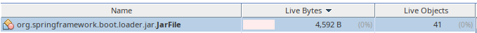
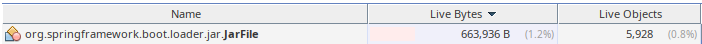

# Spring Boot v2.2.7 Memory Leak 

### Description

After upgrade from Spring Boot 2.2.6 to 2.2.7 application started consuming much more memory.
In particular Heap Dump shows significantly higher number of instances of type:
`org.springframework.boot.loader.jar.JarFile`.

Heap Dump (v2.2.6) is [here](./heap_dump/heapdump-2.2.6.hprof.zip).
It contains the following number of instances:


Heap Dump (v2.2.7) is [here](./heap_dump/heapdump-2.2.7.hprof.zip).
It contains the following number of instances:


The number of instances is significantly higher.

### Reason

After checking the history of related changes there is a couple of commits that worth to be checked:

[Create new JarFile instance for URL connections](https://github.com/spring-projects/spring-boot/commit/c85918b8b35ee6215583020c2ef4287c4f7eca8d)

[Attempt to prevent JarFiles from being left open](https://github.com/spring-projects/spring-boot/commit/7c6e9124633e4ff2f6018c32b8e7f01510ac1528)

[Attempt to prevent JarFiles from being left open](https://github.com/spring-projects/spring-boot/commit/7d53f7d27fb6ed2b606ca55f33616e681b09b7fe)

### Steps to reproduce

Checkout current repository and perform the following steps:

```shell script
$ ./mvnw clean package
$ cd target
$ java -jar spring-boot-2.2.7.RELEASE-memory-leak.jar
```

Now memory profiler can be attached.

After, adjust the version of the parent (`spring-boot-starter-parent`) in POM to `2.2.6.RELEASE`
and perform the following steps:

```shell script
$ ./mvnw clean package
$ cd target
$ java -jar spring-boot-2.2.6.RELEASE-memory-leak.jar
```

Now memory profiler can be attached again.
